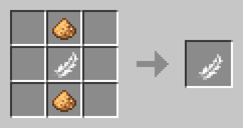
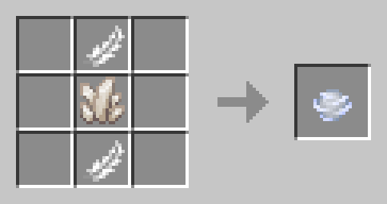
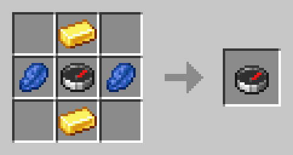

# GOLDARK Collection of Artifacts

Artifacts are magical items which provide unique abilities upon usage.

Below is a list of all existing artifacts in *Golden Arcane*, as of 2025-07-08.

## Table of Contents

- [GOLDARK Collection of Artifacts](#goldark-collection-of-artifacts)
  - [List of Artifacts](#list-of-artifacts)
    - [Daedalus' Feather](#daedalus-feather)
    - [Icarus' Gift](#icarus-gift)
    - [Locator Compass](#locator-compass)
  - [Reference](#reference)

## List of Artifacts

### Daedalus' Feather

Details:

> Durability[^max_damage]: 120  
> Use Cooldown[^use_cooldown]: 10 ticks (0.5 seconds)

Item Recipe:

Crafting (Shaped)

> Notes:
>
> - "Glowstone Dust" can be replaced by "Gold Nugget", and yields the same item.

Summary:

> **Daedalus' Feather** grants a burst of powerful Levitation and Slow Falling, allowing the user to reach high altitudes and break falls with ease.
>
> Using two *Daedalus' Feathers* at once doubles the effect's strength, but also consumes both items' durabilities.

### Icarus' Gift

Details:

> Durability[^max_damage]: 120  
> Use Cooldown[^use_cooldown]: 4 ticks (0.2 seconds)

Item Recipe:

Crafting (Shaped)

> Notes:
>
> - "Nether Quartz" can be replaced by "Gold Ingot", and yields the same item.

Summary:

> **Icarus' Gift** quickly moves the user forward, granting a small window of Levitation to avoid falls. However, its quick use time and low durability also means this item won't last you long.
>
> Using two *Icarus' Gifts* at once double the user's speed, but also drains both items' durabilities.

### Locator Compass

Details:

> Durability[^max_damage]: 120  
> Use Cooldown[^use_cooldown]: 10 ticks (0.5 seconds)

Item Recipe:

Crafting (Shaped)

> Notes:
>
> - "Compass" can be replaced by "Recovery Compass", and yields the same item.
> - For screen reader users: "None" means no item is to be put in the given slot.

Summary:

> **Locator Compass** detects the nearest structure matching its given name, displaying the distance from the user to the target structure in blocks.
>
> In order to use this item, the following procedures must be done:
>
> - Rename the item to the structure name or tag of your choice. (e.g. "desert_pyramid" or "#villages")
> - Drop the item above a lit Candle, and use a [Divine Catalyst](./Spell%20Recipes.md#divine-catalyst) on it.
> - If done successfully, the item will now be enchanted, and using it will tell the exact distance to the structure of choice.
>
> Note: The first time using this item to locate a particular structure might induce some brief lag, depending on how far the structure is to the player. This is a limitation of the game and cannot be remediated without modding.

## Reference

[^max_damage]: The amount of times this item can be used before breaking.
[^use_cooldown]: How much time before the item can be used again. For reference, every 20 ticks equals 1 second.
