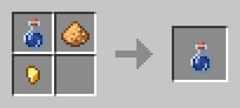

# GOLDARK Effects Table

Effects are passive alterations to one's abilities and/or the environment around themselves.

Below is a full list of all custom effecs within *Golden Arcane*, as of 2025-07-08.

## Table of Contents

- [GOLDARK Effects Table](#goldark-effects-table)
  - [List of Effects](#list-of-effects)
    - [Instant Mana](#instant-mana)
    - [Luminance](#luminance)
    - [Purity](#purity)

## List of Effects

### Instant Mana

Details:

> Type: `NEUTRAL`  
> Duration: Instantaneous

Potion Recipe:

Crafting (Shapeless)

> Notes:
>
> - In-game potion color is #23CACE (Turquoise).  
> - Ingredients may be put in any pattern and still yield the same item.
> - "Water Bottle" means any kind of `potion` item; However, potion effects do not affect the resulting item.

Summary:

> **Instant Mana** restores a random amount of the player's Mana, while also setting them on *Mana Sickness*, an invisible status effect which prevent most magical features from being used.

### Luminance

Details:

> Type: `POSITIVE`  
> Duration: (03:00)

Potion Recipe:

Crafting (Shapeless)

> Notes:
>
> - In-game potion color is #ECCE44 (Gold/Mustard).  
> - Ingredients may be put in any pattern and still yield the same item.
> - "Water Bottle" means any kind of `potion` item; However, potion effects do not affect the resulting item.

Summary:

> **Luminance** creates a constant source of light at the user's position. This light follows them around, and is extinguished once the effect ends.
>
> Undead mobs near the light are lit on fire, and burn as if under sunlight. The user is also visible through walls for the duration of the effect.

### Purity

Details:

> Type: `NEGATIVE`  
> Duration: (01:20)

Potion Recipe:

Crafting (Shapeless)

> Notes:
>
> - In-game potion color is #76ECBF (Aquamarine).  
> - Ingredients may be put in any pattern and still yield the same item.

Summary:

> **Purity** is an effect which prevents all other status effects (except instantaneous ones like Instant Health and Damage) from taking effect. Additionally, those with an [Arcane Path](Paths.md) have all traits, strengths and weaknesses nullified (read: removed temporarily), and all abilities become unavailable.
>
> As with other effects, Purity can be removed early by drinking a Milk Bucket.
