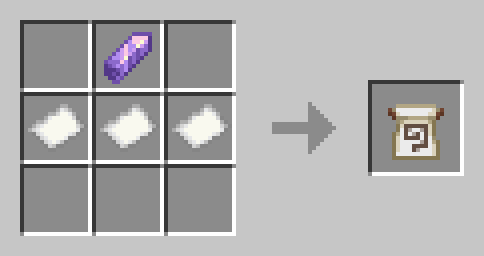

# GOLDARK Bag of Miscellaneous Things

Below is a list of miscellaneous items and features of *Golden Arcane*, as of 2025-07-08.

## Table of Contents

- [GOLDARK Bag of Miscellaneous Things](#goldark-bag-of-miscellaneous-things)
  - [List of Miscellaneous Items](#list-of-miscellaneous-items)
    - [Scroll of Essence](#scroll-of-essence)
    - [Totem of Lycanthropy](#totem-of-lycanthropy)
    - [Amulet of Purity](#amulet-of-purity)
  - [List of Debug Items](#list-of-debug-items)
    - [Enable Trigger Settings](#enable-trigger-settings)
    - [Toggle Datapack](#toggle-datapack)

## List of Miscellaneous Items

### Scroll of Essence

Details:

> Type: `Consumable`, `Stackable` (64)

Item Recipe:

Crafting (Shaped)

> Notes:
>
> - For screen reader users: "None" means no item is to be put in the given slot.

Summary:

> **Scroll of Essence** "seals" a spell it is placed on, storing it in an item form. Placing the item again "releases" the spell, converting it into a Wisp. Instantaneous spells (such as [Banish](./Spell%20Recipes.md#banish) and [Conjure: Blood Weapon](./Spell%20Recipes.md#conjure-blood-weapon)) cannot be stored by a *Scroll of Essence*.
>
> Wisp spells have no requirements for their placement; Instead, they follow around their owner, despawning after 600 ticks (30 seconds) have passed. They do not, however, drop any items upon expiring. Furthermore, if a Wisp spell can't find its owner (likely if they're dead), it also despawns instantly.
>
> Placing a spell while sneaking will not convert it to a Wisp, but if the spell's placement requirements (see the [Recipe Book](./Spell%20Recipes.md)) are not met, the spell will also break immediately.

### Totem of Lycanthropy

Details:

> Type: `Death Protection`, `Transformation`

Item Recipe:

Crafting (Shaped)

> Notes:
>
> - "Totem of Undying" can be replaced by "Enchanted Golden Apple", and yields the same item.
> - "Gold Ingot" can be replaced by "Emerald", and yields the same item.
> - For screen reader users: "None" means no item is to be put in the given slot.

Summary:

> **Totem of Lycanthropy** protects the user from death, akin to a Totem of Undying, but with a cost: the user is also converted into a Werewoof upon cheating death.
>
> The transformation is permanent, but reversible. All effects and consequences of this are listed in the [Map to Arcane Paths](./Paths.md#werewoof).

### Amulet of Purity

Details:

> Type: `Consumable`, `Transformation`

Item Recipe:

Crafting (Shaped)

> Notes:
>
> - "Golden Apple" can be replaced by "Golden Carrot" or "Glistering Melon Slice", and yields the same item.
> - For screen reader users: "None" means no item is to be put in the given slot.

Summary:

> **Amulet of Purity** reverts the user's [Arcane Path](./Paths.md), at the cost of applying a range of debilitating effects, the most notorious being Wither III, which *can* kill if the user does not act quickly.
>
> Once reverted, the user is entirely "human" again, with no traits or abilities from previous Paths. In order to gain access to those again, one must do the same procedures as before for conversion.

## List of Debug Items

Debug items exist for purely technical reasons, and all except [Enable Trigger Settings](#enable-trigger-settings) may be removed at any time with no prior warning.

### Enable Trigger Settings

Details:

> Type: `Consumable`, `Debug`

Item Recipe:

Crafting (Shaped)

> Notes:
>
> - "Paper" can be replaced by "Sugar", and yields the same item.

Summary:

> **Enable Trigger Settings** allows non-host players to use the datapack's settings menu panel, accessible with the command `/trigger goldark.settings`.
>
> The host does not need to use this, as they're automatically granted this privilege. This item may only be used once, and does nothing to the player afterwards.

### Toggle Datapack

> [!WARNING]  
> This item exists for emergency situations only; If you cannot trust your players with its usage, please remove its recipe file at `BP/data/goldark/recipes/_debug/toggle_datapack.json`.

Details:

> Type: `Consumable`, `Debug`

Item Recipe:

Crafting (Shaped)

> Notes:
>
> - "Redstone Block" can be replaced by "Iron Block", and yields the same item.

Summary:

> **Toggle Datapack** enables/disables the datapack globally, preventing execution of all functions and features of *Golden Arcane*.
>
> This item is to be kept for extreme cases where the datapack's functioning goes out of control, to the point of risking irreversible damage to your world. Using the item while the datapack is disabled re-enables it again.
