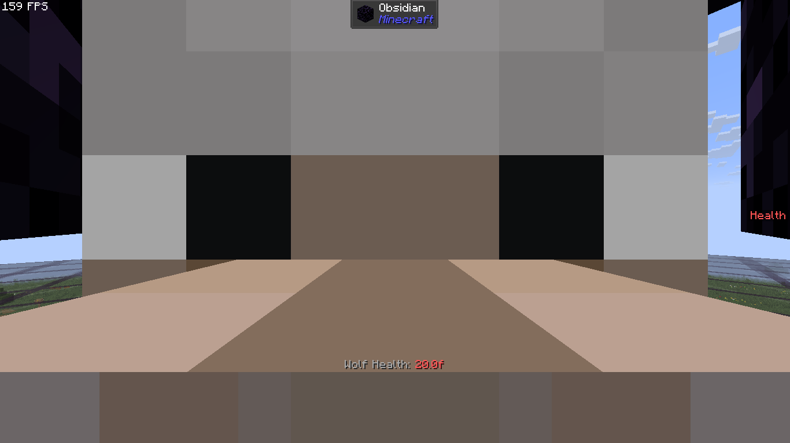

# GOLDARK Map to Arcane Paths

Arcane Paths are special class-like traits one may optionally acquire in Golden Arcane. These provide new abilities, strengths and weaknesses, as well as unique and exclusive spells and artifacts.

Below is a list of all Arcane Paths introduced in *Golden Arcane*, as of 2025-07-08.

## Table of Contents

- [GOLDARK Map to Arcane Paths](#goldark-map-to-arcane-paths)
  - [List of Arcane Paths](#list-of-arcane-paths)
    - [Werewoof](#werewoof)
  - [Reference](#reference)

## List of Arcane Paths

### Werewoof

> An insatiable urge for violence;
> An unstoppable beast of destruction.

The **Werewoof** is the first available Path to the player, featuring primarily the ability to transform into a Wolf. Its traits focus on raw strength and endurance, and its main weakness is Iron.

Traits: (Werewoof Perk[^perk])

> +2 Attack Damage  
> +50% Attack Knockback  
> +33% Jump Strength  
> +10% Knockback Resistance  
> +2 Safe Fall Distance[^fall]

Weaknesses:

> \- Iron-based blocks (blocks made purely of or primarily out of Iron) damage the player; This damage is doubled if the player is *in* the block (e.g. Iron Bars, Doors, Heavy Pressure Plates...)  
> \- Wearing Iron armor harms the player as if they were inside an Iron block  
> \- Holding an Iron-based item weakens the player severely for as long as they hold it

Abilities:

> \+ Press `CTRL`+`S` to Transform into a Wolf.  
> \+ After being around hostile mobs for a while, Wolf form enters **Rage Mode**, receiving a large boost in speed and damage, while also weakening nearby foes.  
> \+ TODO.

Gallery:

In-game screenshots

> Boop

## Reference

[^perk]: Perks are collections of traits automatically granted to every user of a particular path. As with other abilities and behaviors, they can be temporarily nullified with the [Purity](./Effects.md#purity) effect.

[^fall]: The amount of blocks you can fall before taking damage.
