# GOLDARK Spells Recipe Book

Below is a full list of all registered Golden Arcane spells, as of 2025-07-08.

## Table of Contents

- [GOLDARK Spells Recipe Book](#goldark-spells-recipe-book)
  - [List of Spells](#list-of-spells)
    - [Primordial](#primordial)
      - [Warp Gate](#warp-gate)
    - [Divine](#divine)
      - [Deflect](#deflect)
      - [Smite](#smite)
    - [Imperial](#imperial)
      - [Silence](#silence)
      - [Ward](#ward)
    - [Forbidden](#forbidden)
      - [Fireball](#fireball)
    - [Eldritch](#eldritch)
      - [Banish](#banish)
    - [Sacrificial](#sacrificial)
      - [Conjure: Blood Weapon](#conjure-blood-weapon)
  - [List of Catalysts](#list-of-catalysts)
    - [Primordial Catalyst](#primordial-catalyst)
    - [Divine Catalyst](#divine-catalyst)
    - [Imperial Catalyst](#imperial-catalyst)
    - [Forbidden Catalyst](#forbidden-catalyst)
    - [Eldritch Catalyst](#eldritch-catalyst)
    - [Sacrificial Catalyst](#sacrificial-catalyst)

## List of Spells

### Primordial

#### Warp Gate

Metadata:

> Type: **`Primordial`**  
> Class: `One-Use`, `Persistent`  
> Cost: 10 Mana

Ingredients:

> 4x Candle  
> 1x Netherrack (Optional)  
> 1x Soul Sand/Soil (Optional)  
> 1x [Primordial Catalyst](#primordial-catalyst)

Structure in-game:

In-game screenshots

> Fire: Teleports to last respawn point.

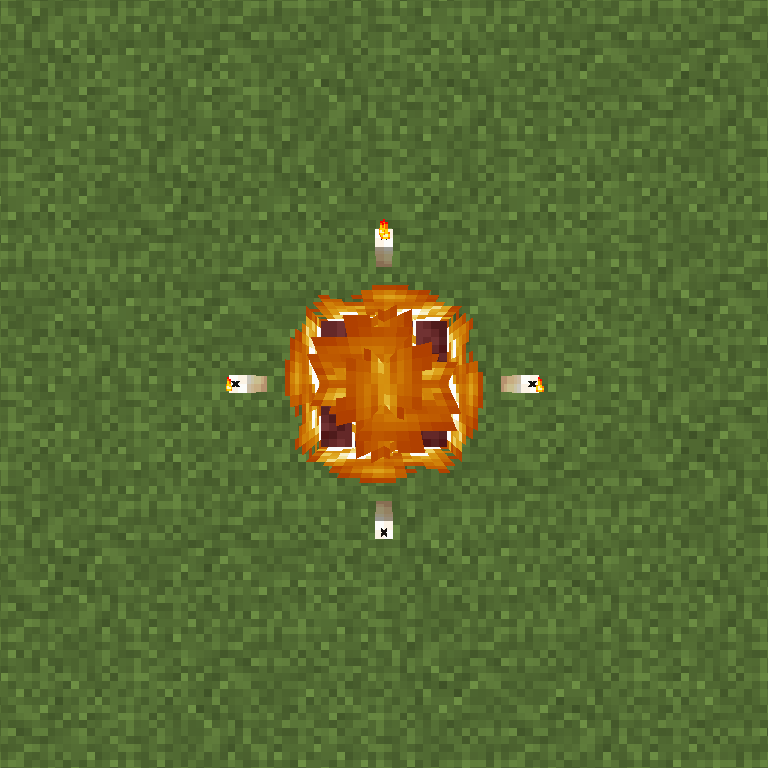

> Soul Fire: Teleports to last death point.

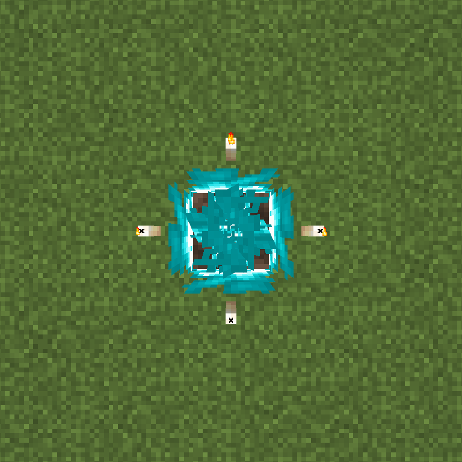

Summary:

> Warp Gate tears a hole in reality, connecting you to a recent location you have visited before. As of the creation of this document (see above), two variants are available:
>
> - By using regular *Fire* to activate the spell, it will link to your **last respawn point**, usually a bed or Respawn Anchor.
> - By using **Soul Fire** to activate the spell, it will link to your **last death location**. This works across all dimensions, but does not protect you from your death cause, like lava or the Void.
>
> Once activated, a Warp Gate remains indefinitely until used, after which it despawns itself. Warp Gates do not update their linked locations, so if you e.g. die to a Zombie, open a Gate, then die of fall damage, your first Gate will remain linked to the first death location, while all subsequent ones will link to the most recent death instead.

### Divine

#### Deflect

Metadata:

> Type: **`Divine`**  
> Class: `Area-of-Effect`, `Persistent`  
> Cost: 5 Mana

Ingredients:

> 1x Candle  
> 1x Bone  
> 1x Gold Block  
> 1x [Divine Catalyst](#divine-catalyst)

Structure in-game:

In-game screenshot

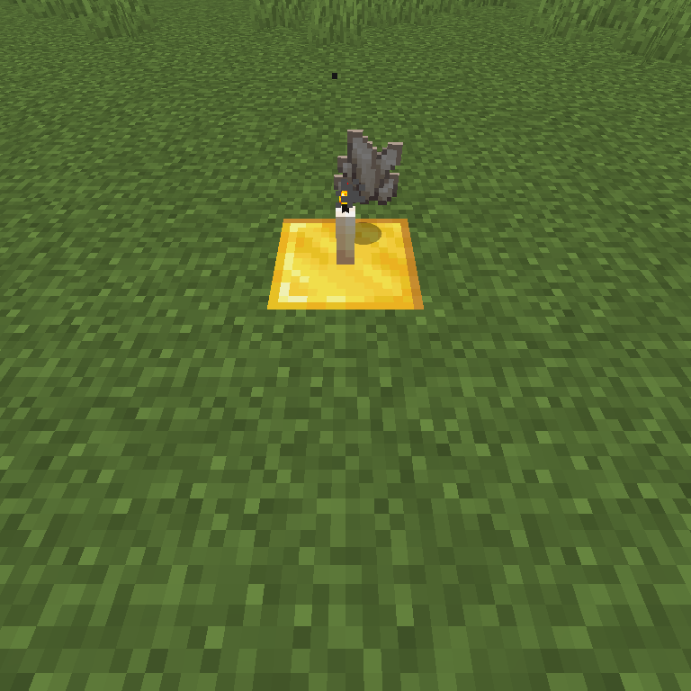

Summary:

> Deflect prevents all projectiles (except potions) from entering its radius. If a projectile is thrown in its direction, it is stopped mid-air, then falls to the ground. Fireballs and Wind Charges hover in the air instead, and can be hit to be redirected. Projectiles redirected this way are never stopped by a Deflect spell.

#### Smite

Metadata:

> Type: **`Divine`**  
> Class: `Area-of-Effect`, `Persistent`  
> Cost: 5 Mana

Ingredients:

> 1x Candle  
> 1x Nether Quartz  
> 1x Gold Block  
> 1x [Divine Catalyst](#divine-catalyst)

Structure in-game:

In-game screenshot

> Smite attacks hostile\* undead creatures in its radius, shooting a bolt of light magic which homes towards the nearest target. If no enemies are nearby, these bolts home towards the nearest passive\** entity instead, including the player.
>
> Non-undead hostile entities are infliced with powerful Wither and Slowness effects instead.
>
> \* "Hostile" includes Skeleton and Zombie Horses, which are considered passive by the game.
> \*\* "Passive" includes Iron Golems and Wolves, which are otherwise considered as Neutral by this datapack.

### Imperial

#### Silence

Metadata:

> Type: **`Imperial`**  
> Class: `Area-of-Effect`, `Persistent`  
> Cost: 5 Mana, 5 EXP

Ingredients:

> 1x Candle  
> 1x Echo Shard  
> 1x [Imperial Catalyst](#imperial-catalyst)

Structure in-game:

In-game screenshot

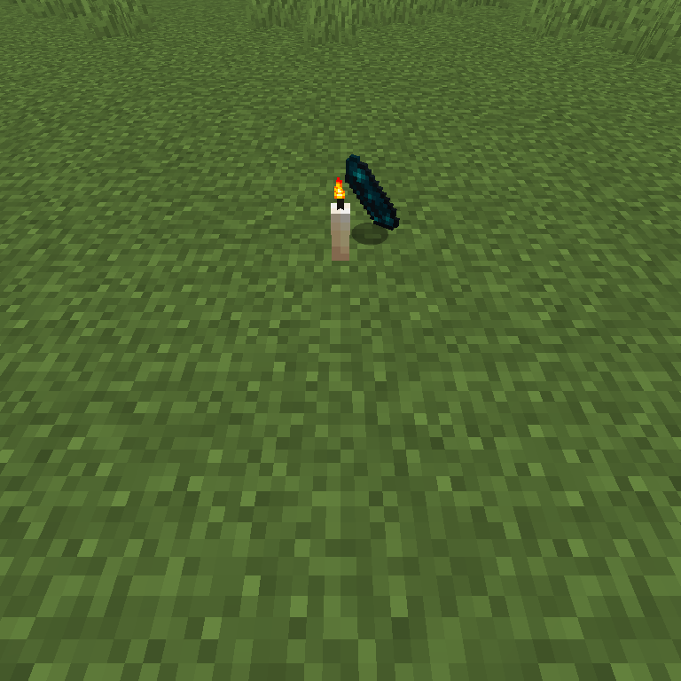

Summary:

> Silence prevents all mobs in a large radius from making any kind of noise, including but not limited to ambient, hurt and death sounds. It also prevents all players from using artifacts or regenerating Mana, which is a requirement for most spells' activation.

#### Ward

Metadata:

> Type: **`Imperial`**  
> Class: `Area-of-Effect`, `Persistent`  
> Cost: 4 Mana, 3 EXP

Ingredients:

> 1x Candle  
> 1x Redstone (item)  
> 1x [Imperial Catalyst](#imperial-catalyst)

Structure in-game:

In-game screenshot

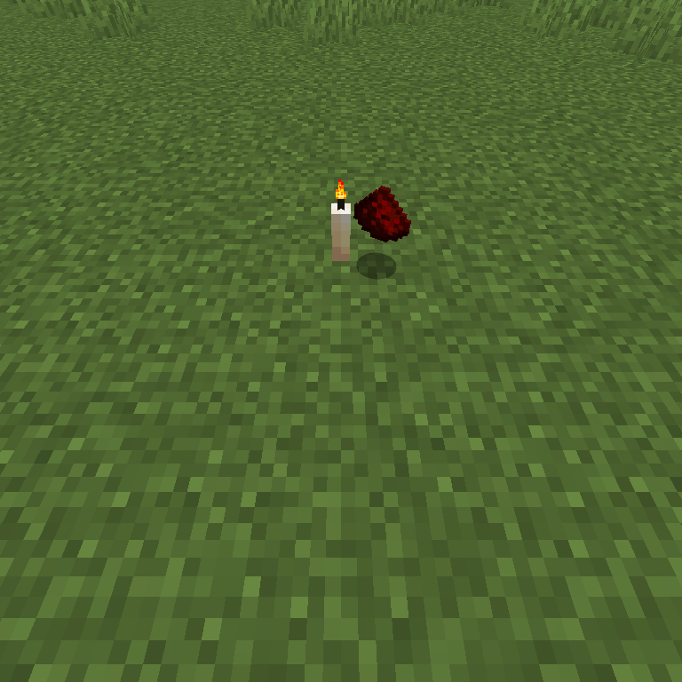

Summary:

> Ward prevents hostile\* mobs from entering its radius, while paralysing those who manage to get further inside. It does not, however, prevent large enough enemies (such as big Slimes) from hurting the player regardless.
>
> \* Terms and conditions apply; See "[Smite](#smite)".

### Forbidden

#### Fireball

Metadata:

> Type: **`Forbidden`**  
> Class: `One-Use`, `Persistent`  
> Cost: 9 Mana

Ingredients:

> 1x Gold Block  
> 1x Glowstone  
> 4x Fire (block)  
> 4x Netherrack (Optional)  
> 1x Flint and Steel (Optional)  
> 1x [Imperial Catalyst](#imperial-catalyst)

Structure in-game:

In-game screenshots

> Base blocks (Netherrack optional)

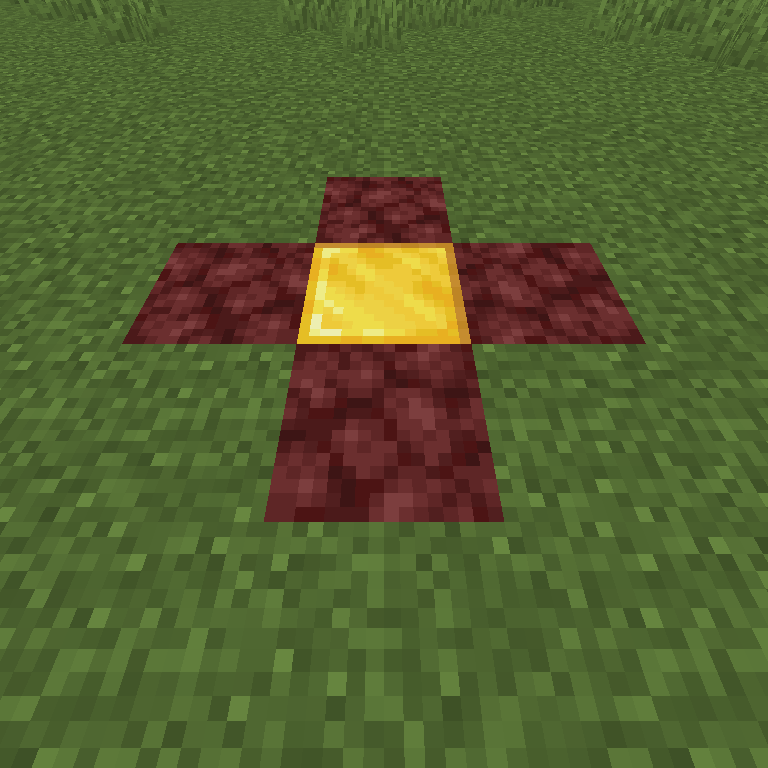

> Same as before, with fire added above.

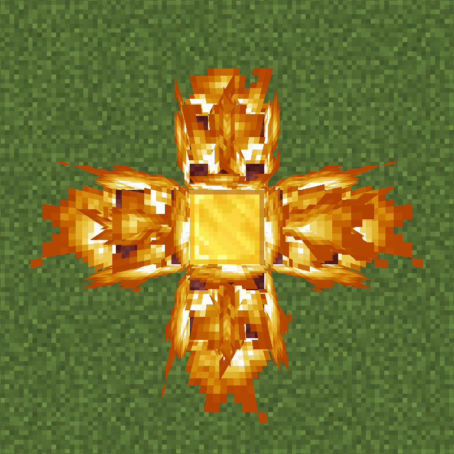

> Same as before, with the Glowstone block added; **This is the proper spell pattern.**

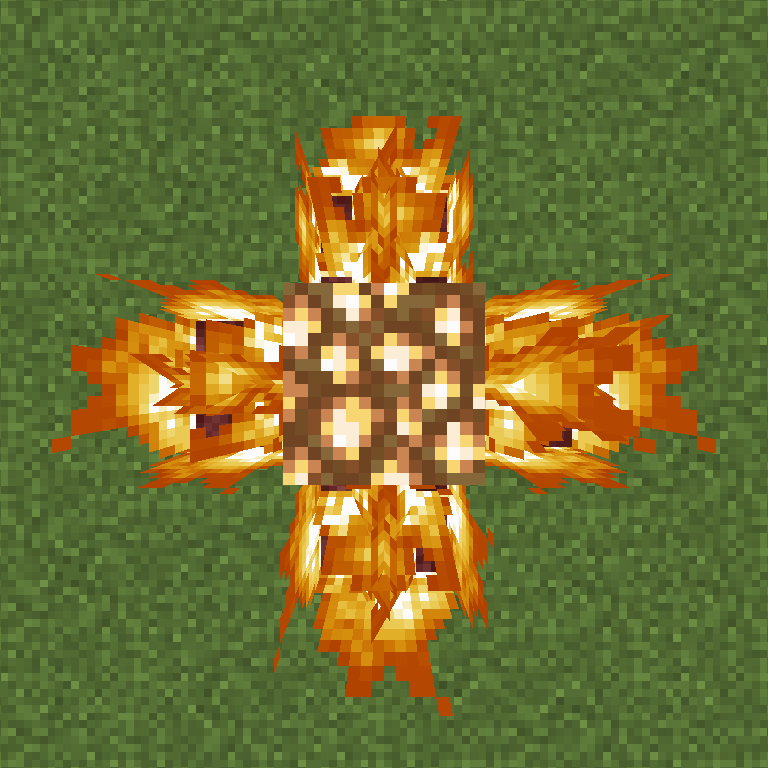

Summary:

> Fireball summons a Fireball entity with an explosion power of 3 (for reference, a Ghast fireball has an explosion power of 2). This fireball is static and must be hit by the player or a projectile to take motion.
>
> Beware, for this spell's destructiveness is only matched by its lethality.

### Eldritch

#### Banish

> [!WARNING]  
> This spell requires the [Werewoof](./Paths.md#werewoof) Arcane Path.

Metadata:

> Type: **`Eldritch`**  
> Class: `Single Target`, `Persistent`  
> Cost: 15 Mana, 10 EXP

Ingredients:

> 4x Candle  
> 1x Skull  
> 1x Obsidian  
> 1x [Eldritch Catalyst](#eldritch-catalyst)

Structure in-game:

In-game screenshot

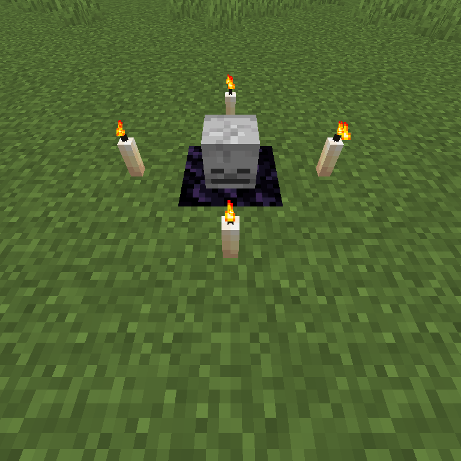

Summary:

> Banish "locks" the nearest creature (that isn't a player) above itself, before consuming them wholly and erasing them from reality. Such is its power that all other creatures (including the player) in a large radius are debuffed as well, being weakened and blinded by the horrors just witnessed.
>
> Unfortunately (or not), Banishment's magic is only powerful enough to kill mobs with up to 100 health (50 hearts; same as an Iron Golem). The following creatures are immune to Banishment:
>
> - All bosses (Ender Dragon, Wither)
> - Warden
> - Player
> - Wolf\*
>
> Once Banishment's magic is triggered, though, nothing can stop it. (well, unless the creature dies first by other means...) Beware of who and where you use such power with.
>
> \* Due to it being a [Werewoof](./Paths.md#werewoof) spell, Wolves are automatically excluded from potential targets.

### Sacrificial

#### Conjure: Blood Weapon

Metadata:

> Type: **`Sacrificial`**  
> Class: `Single Target`, `Persistent`  
> Cost: 5 Health, 7 EXP

Ingredients:

> 1x Enchanting Table  
> 4x Redstone Torch  
> 1x [Sacrificial Catalyst](#sacrificial-catalyst)

Structure in-game:

In-game screenshot

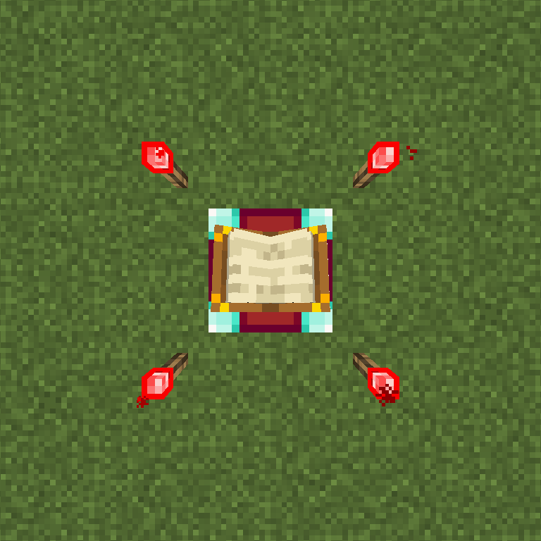

Summary:

> Conjure: Blood Weapon conjures an enchanted weapon created by the player's own life essence. The weapon is always an Iron Sword enchanted with varying levels of **Decaying** and **Demanding**.
>
> - *Decaying* causes a weapon to swing much faster, but also break more quickly. At its full power, every swing is full of power, but the afflicted tool is brittle like gold, if not worse.
> - *Demanding* directly harms the user on every attack. In exchange, it spawns "Blood Wisps", manifestations of life energy which hunt down enemies and consume *their* health instead. If no enemies are nearby, the Wisp returns to its owner, granting them Regeneration for a short time.
>   - Note: Each level of Demanding takes more health than the previous, but the Blood Wisps do not become stronger. Beware of high levels of this enchantment, as they can be more lethal than your enemies.
>     - Demanding will never *directly* kill the user, as it will stop consuming health (and spawning Wisps) if the player's health is too low. It can, however, make it much easier for *others* (such as mobs, or environmental hazards) to finish you instead.

## List of Catalysts

Below is a list of all Magic Catalysts in *Golden Arcane*. Catalysts awaken the dormant magic within, allowing a collection of mundane materials to become a powerful manifestation of magic; a spell.

### Primordial Catalyst

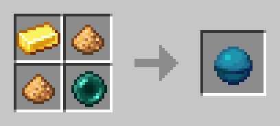

Primordial Catalysts are capable of activating [Primordial](#primordial) spells; It is generally used on **Fire** blocks.

Usually, Primordial spells require a couple blocks for its "recipe", with the fire as the center point. None of the original blocks are required after activation.

### Divine Catalyst

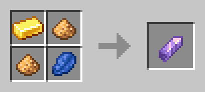

Divine Catalysts are capable of activating [Divine](#divine) spells; It is generally used on lit **Candle** blocks.

Usually, Divine spells require a lit candle and a block below it. Breaking the candle will expire the spell.

### Imperial Catalyst

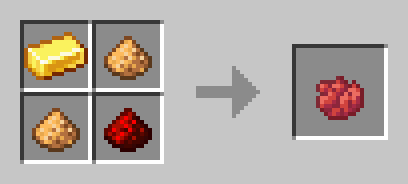

Imperial Catalysts are capable of activating [Imperial](#imperial) spells; It is generally used on lit **Candle** blocks.

Usually, Imperial spells require a lit candle and some EXP, and will not activate if the player has less than one level.

As with Divine spells, breaking the candle will also expire the spell.

### Forbidden Catalyst

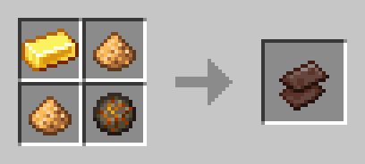

Forbidden Catalysts are capable of activating [Forbidden](#forbidden) spells; It has no particular block attributed to its magic.

Usually, Forbidden spells require a wide range of blocks, most of which are consumed upon activation.

### Eldritch Catalyst

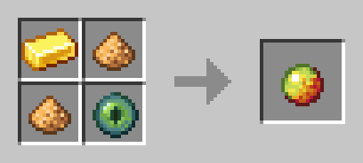

Eldritch Catalysts are capable of activating [Eldritch](#eldritch) spells; It is generally used on **Skull** blocks.

Usually, Eldritch spells require a block pattern and some EXP, and will not activate if the player has less than two levels.

Unlike Divine spells, breaking any of the blocks has no effect on the spell itself. However, if the target entity leaves the spell's radius, it immediately cancels itself.

### Sacrificial Catalyst

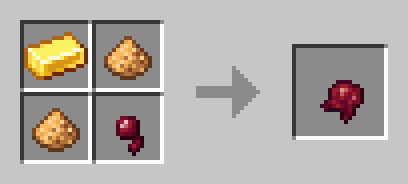

Sacrificial Catalysts are capable of activating [Sacrificial](#sacrificial) spells; It has no particular block attributed to its magic.

Usually, Sacrificial spells require health and experience points, and will not trigger on the following occasions:

- The player does not have the required experience;
- The player does not have the required health points;
- The player has the exact amount of health points required, and triggering the spell would kill them.

Sacrificial spells also have no delay or "progress" to them; Every spell is a direct and immediate exchange of life for power.
